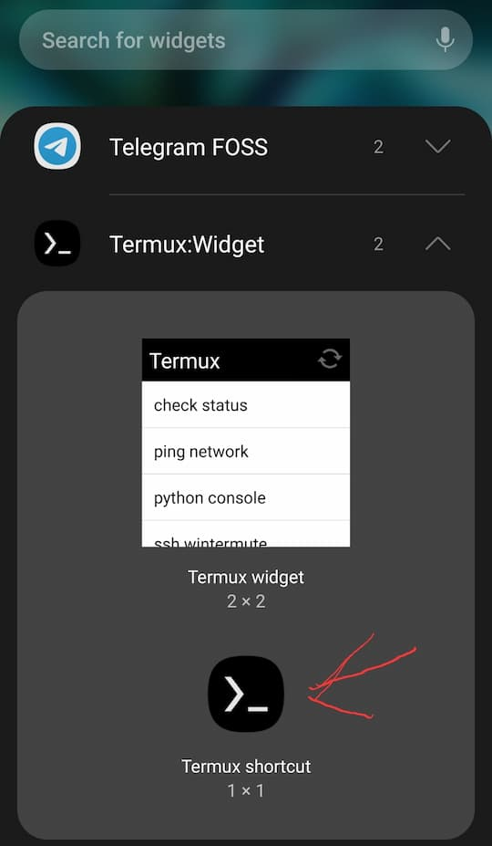
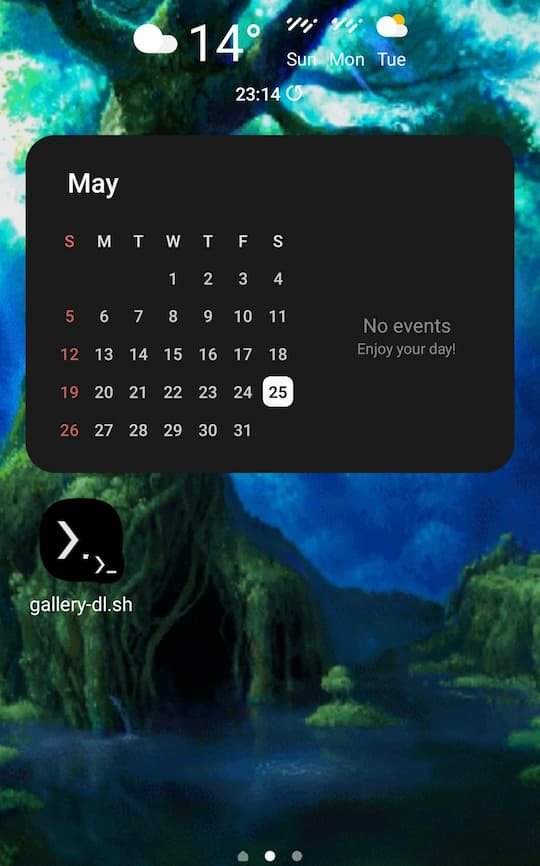

+++
title = "Baixando memes no Android com apenas um botão"
date = "2024-05-19T19:39:54-03:00"
draft = true
description = "Minha gambiarra pra baixar memes usando termux, scripts e widgets."

tags = ["gambiarra","termux","android","shell scripting","memes"]
+++

# Baixando memes no Android com apenas um botão


*♫Tipos de carinha são...!♫*

Irei apresentar minha gambiarra que atualmente uso para adquirir a maioria de
meus memes no Android, uma idéia que surgiu da incoveniência que é baixar
imagens e vídeos do Instagram. O método resume-se ao simples apertar de um
botão, que aciona um script cuja função é fazer todo o trabalho sujo por nós
😈. E, com um pouco de leitura e pequenas modificações, os passos podem
ser adaptados para outros sites/redes sociais que também não oferecem opções
acessíveis para baixar mídias.

Nem preciso dizer que deve ser impossível replicar algo similar no iOS né? Não
gosto de queimar a língua, mas já sabemos da natureza desse sistema 👀. De
qualquer forma, esta é uma solução para um problema que só um ~~anormal~~
[acumulador digital](https://www.reddit.com/r/DataHoarder/)  como eu
precisaria.

Sendo o Android baseado em Linux, podemos utilizar o emulador de terminal 
[Termux](https://termux.dev/en/), que nos entrega um ambiente similar à aqueles
encontrados em uma distro Linux
([diferenças técnicas](https://wiki.termux.com/wiki/Differences_from_Linux)).
Enquanto o Termux será o núcleo por trás de nossa operação, 
[Termux-widget](https://github.com/termux/termux-widget) trará nossa feature
principal da gambiarra: um pequeno botão ativador de scripts para usarmos na
tela inicial. 

Termux é tão magnífico que pretendo escrever um post apenas para ele.
Aguardem...

---

## Termux, setups e scripts

Para baixar o Termux junto com o widget, é recomendável seguir as
[instruções dos próprios desenvolvedores](https://github.com/termux/termux-app#f-droid),
atentando-se ao fato de que as builds existentes na Play Store
*não devem ser baixadas!* Eu mesmo baixei tudo pelo
[F-Droid](https://f-droid.org/en/packages/com.termux/) usando o aplicativo
[Droid-ify.](https://f-droid.org/pt_BR/packages/com.looker.droidify/)

Independente do método que escolher, assim que iniciar o Termux, é recomendável
atualizar o ambiente:

```shell
$ pkg upgrade
```

e então, instalar os pacotes que iremos precisar:


```shell
$ pkg install termux-api python
$ python -m pip install -U gallery-dl
```

- `termux-api`: contém utilidades essenciais para nosso script, como
`termux-clipboard-get`;
- `python`: necessário para usarmos o gerenciador de pacotes `pip`;
- `gallery-dl`: o triunfo de nossa gambiarra - um programa que baixa
imagens de vários websites;

Após baixar os pacotes, devemos permitir o acesso do Termux ao armazenamento
do seu Android:

```shell
$ termux-setup-storage
```

Permita o acesso através do pop-up e pronto.

Agora, devemos criar o diretório onde armazenaremos os arquivos de configuração
e cookies para o `gallery-dl`, além do diretório onde o Termux-widget procura
por scripts:

```shell
$ mkdir -p ~/.config/gallery-dl ~/.shortcuts
```

Configurar ou não o `gallery-dl` irá depender do seu uso. Na maior parte dos
casos, ele é perfeitamente funcional sem nenhum tipo de configuração. Porém, o
Instagram é uma das exceções - é necessário autenticação para fazer-lo
funcionar corretamente. Mais especificamente, preciso fornecer um arquivo contendo 
cookies de um navegador logado no Instagram. Para saber quais websites requerem
este mesmo procedimento, junto com instruções mais adequadas, leia
[esta seção aqui.](https://github.com/mikf/gallery-dl#cookies)

Existem extensões para navegadores que exportam os cookies no formato adequado,
mas no meu caso, nenhum dos arquivos foi devidamente reconhecido pelo
`gallery-dl`. Tive sucesso apenas quando utilizei uma opção do próprio software
para exportar um arquivo adequado. Infelizmente, este passo em especial requer
um computador com o software instalado, pois o Termux obviamente não consegue
acessar os cookies de seu navegador no Android.

Em um computador com seu navegador logado no Instagram, baixe o `gallery-dl`
de acordo com as [instruções oficiais](https://github.com/mikf/gallery-dl?tab=readme-ov-file#installation)
e então execute o comando:

```shell
$ gallery-dl --cookies-from-browser firefox/.instagram.com --cookies-export cookies.txt --no-download "{INSIRA AQUI LINK DE UM POST DO INSTA QUALQUER}"
```

Obviamente este comando deverá ser adaptado para coincidir com o seu browser,
além do local onde queira exportar os cookies. Mais detalhes podem ser vistos
[aqui.](https://github.com/mikf/gallery-dl/blob/master/docs/options.md#cookie-options)

Com o arquivo em mãos, envie-o para seu smartphone e então abra o Termux e
copie-o para o diretório do `gallery-dl`:

```shell
$ cp ~/storage/shared/{INSIRA LOCALIZAÇÃO DO ARQUIVO}/cookies.txt ~/.config/gallery-dl
```

Finalmente, é hora de editar o arquivo de configuração! Usando o `nano`:

```shell
$ nano ~/.config/gallery-dl/config.json

# Cole o seguinte texto:

{
    "extractor": {
        "instagram": {
            "cookies": "/data/data/com.termux/files/home/.config/gallery-dl/cookies.txt"
        }
    }
}
```

E agora, vamos colocar nosso script em ação:

```shell
$ nano ~/.shortcuts/gallery-dl.sh
# Cole o seguinte texto:

#!/bin/sh

PREFIX=/data/data/com.termux/files/usr/bin
PARAMS=--no-mtime
PATH=/storage/emulated/0/Download
URL=$($PREFIX/termux-clipboard-get)

$PREFIX/gallery-dl $PARAMS --directory $PATH $URL
```
- O parâmetro `--no-mtime` ignora o tempo de modificação original do arquivo.
Uso isto pois prefiro meus memes organizados na ordem que baixei, mas caso
queira em ordem de criação, então basta remover este parâmetro.
- O `gallery-dl` irá armazenar as imagens no local que a variável `PATH`
indica. Caso queira escolher outro diretório, basta mudar o caminho.
- Note que o `$PREFIX` também encontra-se na variável `URL`. Sem um caminho
absoluto, o script não irá encontrar o `termux-clipboard-get`. 
- Obviamente ficarei mais que feliz caso sugiram melhoras no script 😁. Meu
intuito foi deixar-lo limpo e portátil.

Depois, salve o arquivo e saia. Execute o seguinte comando para permitir a
execução do script pelo Termux:

```shell
$ chmod +x ~/.shortcuts/gallery-dl.sh
```

---

## O widget

Praticamente terminamos! Agora falta adicionar o widget na tela inicial:


*O widget maior é mais adequado caso tenha múltiplos scripts*


*Selecione o script gallery-dl.sh*


*Voila!*

Agora, basta copiar uma URL, clicar no widget na tela inicial e esperar o
script realizar sua magia!
